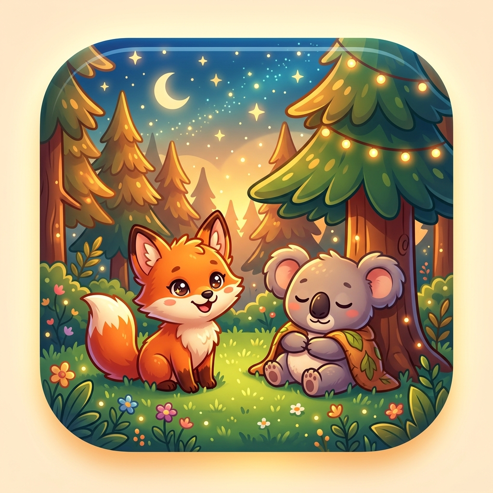
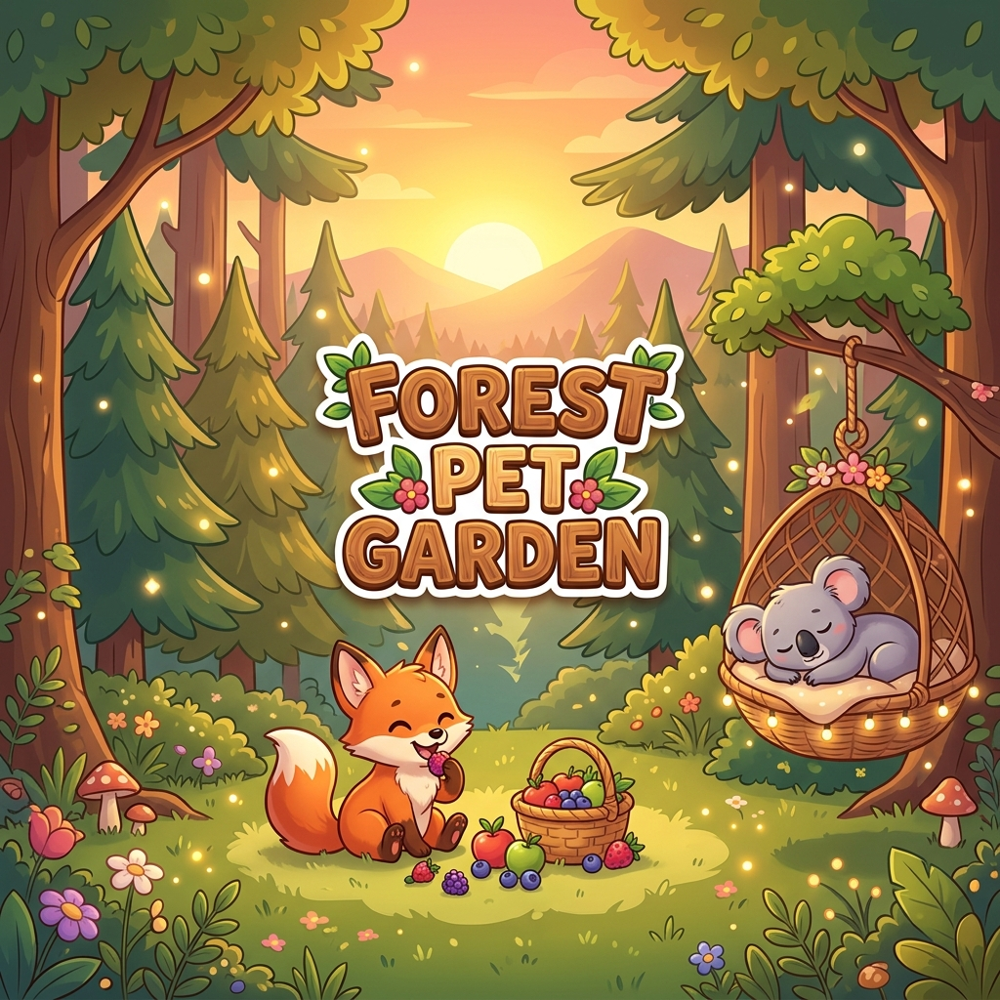
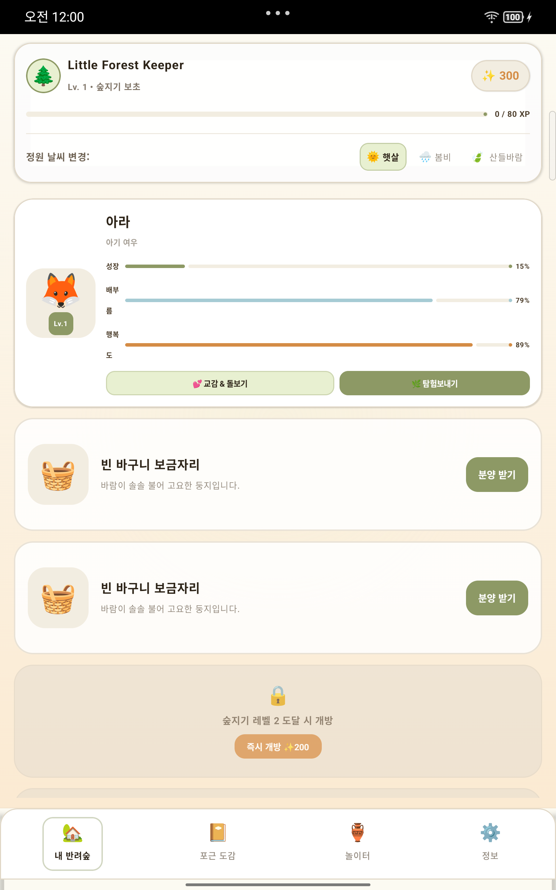
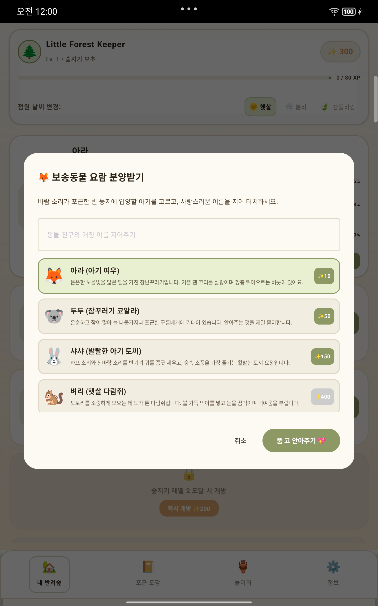
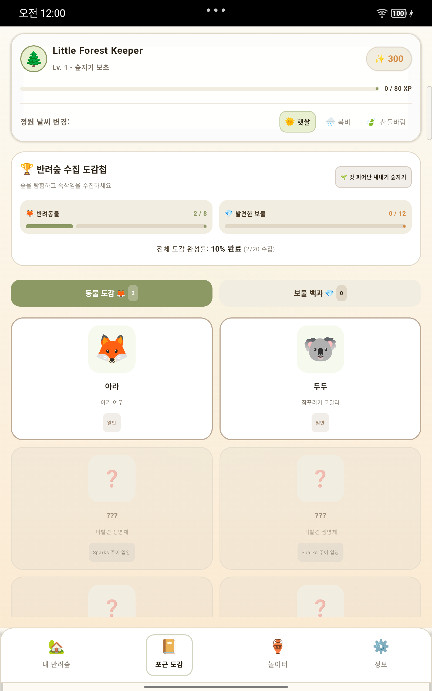

<div align="center">



# 숲속 펫 정원 · Forest Pet Garden

**아기자기한 가상 반려동물을 입양해 키우고, 한적한 소나무 숲을 탐험하며 귀여운 보물을 모으는 평화로운 오프라인 펫 가든 시뮬레이션**

<br/>


<br/>



</div>

---

## 🌿 소개

**숲속 펫 정원**은 인터넷 연결 없이 즐기는 잔잔한 힐링 펫 육성 게임입니다. 노을빛 털을 가진 아기 여우 **아라**, 잠꾸러기 코알라 **두두** 같은 귀여운 친구들을 입양해 밥을 먹이고 놀아 주세요. 안개 낀 숲길로 탐험 소풍을 보내면, 시간이 흐른 뒤 반짝이는 별빛 조약돌이나 잊혀진 엘프 자개화 같은 보물을 물어 옵니다.

## ✨ 주요 기능

- 🦊 **펫 8종 입양** — 일반부터 전설까지, 저마다 좋아하는 먹이·장난감과 사연을 가진 친구들
- 🍎 **돌보기** — 먹이 주기와 놀아 주기로 친밀도와 정원 경험치를 쌓아 레벨 업
- 🌲 **탐험 소풍 5단계** — 소담스런 수풀부터 고대 고목 등불아래까지, 정원 레벨에 따라 열리는 탐험지
- ⭐ **수집 도감 12종** — 희귀도별 보물을 발굴해 채워 가는 컬렉션
- 📴 **완전 오프라인** — 계정·광고·인터넷 권한 없이, 내 기기에 안전하게 저장

## 🛠️ 기술 스택

| 영역 | 사용 기술 |
| --- | --- |
| 언어 | Kotlin 2.2 |
| UI | Jetpack Compose · Material 3 |
| 아키텍처 | MVVM (ViewModel + StateFlow) |
| 영속성 | Room (KSP) |
| 스크린샷 테스트 | Roborazzi · Robolectric |
| 최소/타깃 SDK | 24 / 36 |

## 🚀 빌드 & 실행

**요구 사항:** [Android Studio](https://developer.android.com/studio) (최신 안정 버전), JDK 17+

```bash
git clone https://github.com/jeiel85/forest-pet-garden-android.git
cd forest-pet-garden-android

# 디버그 빌드 설치
./gradlew installDebug

# 릴리스 번들 (서명 키 필요)
./gradlew bundleRelease
```

> 릴리스 서명은 `.keystore/`의 업로드 키로 이뤄지며, 이 디렉터리는 Git에 포함되지 않습니다.

## 📷 스크린샷

<div align="center">



</div>

---

<div align="center">
<sub>© 2026 jeiel · 숲속 펫 정원 · All rights reserved.</sub>
</div>
